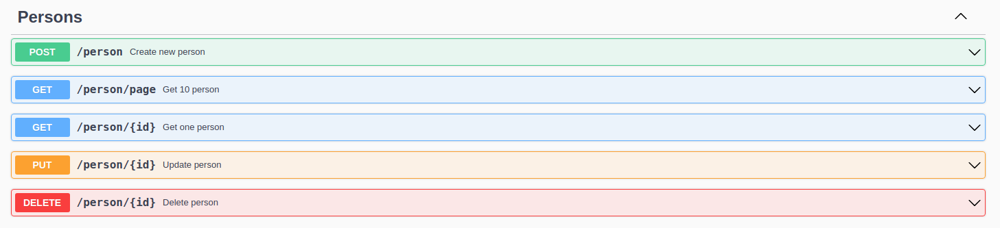

# Effective test

### Deployment
```bash
docker compose up -d --build
```
Available at: http://localhost/api/v1
### Docs
http://localhost/api/v1/swagger/index.html

[](http://localhost/api/v1/swagger/index.html)

### Configuration
For local configuration: edit ```.env``` file. <br/>
For docker configuration: edit ```.env.docker``` file.

### Stack
- Go
- PostgreSQL
- Docker
- nginx
